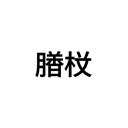

<p align="right">

</p>

<p align="center">

<p>

# 👾 Zenjo [zenjou]

当ツールは静岡大学等のポータルサイトである LiveCampusU を対象としたログイン・各種認証を円滑に行うことを目的としています．

**動作確認済み環境**

<p >


</p>

注：この拡張機能は，国立大学法人静岡大学とは一切関係ありません．\
icon は Google Gemini 君によって生成されました．

## 目次

- [� Zenjo \[zenjou\]](#-zenjo-zenjou)
  - [目次](#目次)
  - [🔧 技術スタック](#-技術スタック)
  - [🪜 ディレクトリ構成](#-ディレクトリ構成)
  - [🎈 実行環境](#-実行環境)
  - [⚙️ 仕様](#️-仕様)
  - [🚀 HowToUse](#-howtouse)
    - [1. ローカルに環境を作成](#1-ローカルに環境を作成)
    - [2. ブラウザの拡張機能管理画面にアクセスする](#2-ブラウザの拡張機能管理画面にアクセスする)
    - [おめでとうございます!!](#おめでとうございます)

## 🔧 技術スタック

<p>


</p>

</p>

## 🪜 ディレクトリ構成

```sh
.
├── README.md
├── access_allow.js
├── content.js
├── darkMode.css
├── manifest.json
├── login.js
└── images/
```

## 🎈 実行環境

この拡張機能は LiveCampusU にのみ対応しています．

## ⚙️ 仕様

1. ボタンの自動押下機能\
   ログインボタンを自動押下します．  
   また，送信属性の選択画面も初期選択肢を自動押下します．

2. ダークモード機能 [beta]\
   背景色等がダークモードになります．

Ad バナーが表示されるようになりました (2025/06/23 更新)  
現在このリポジトリの広告が表示されます．

隠し機能を追加しました（2025/11/08 更新）  
homeページにて学生アイコンをクリックすると...?

## 🚀 HowToUse

### 1. ローカルに環境を作成

```bash
cd {任意のdir}
git clone https://github.com/sauhits/zenjo_clicker.git
```

### 2. ブラウザの拡張機能管理画面にアクセスする

各種ブラウザの拡張機能管理画面ヘアクセスし，`開発者モード > 展開して読み込み`よりリポジトリを読み込む．

---

### <p align="center">おめでとうございます!!</p>

<p align="center">
あなたはもうログインボタンを押す必要がなくなりました！！  
Zenjo をずっと愛してあげてね...
</p>
